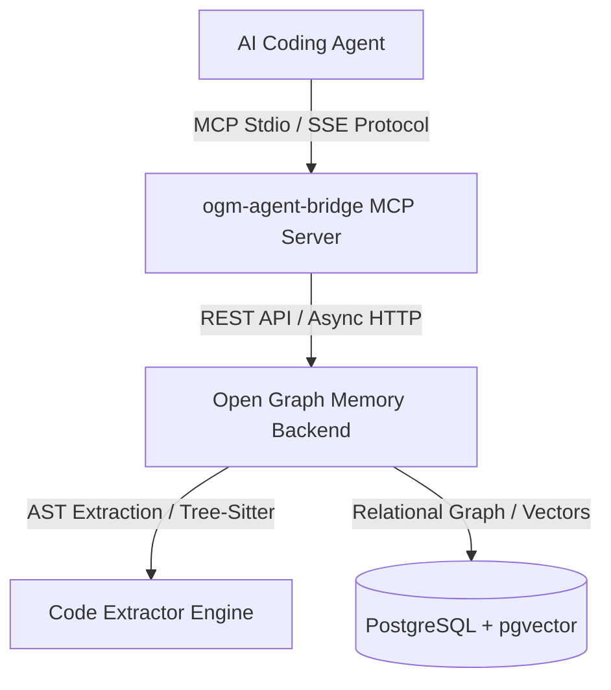

# Open Graph Memory (OGM) Agent Bridge Skill

A production-grade specification, runbook, and tool reference for autonomous AI coding agents interfacing with **Open Graph Memory (OGM)** and the **Codebase Knowledge Graph** via `ogm-agent-bridge`.

---

## 🏗️ System Architecture

---

## 🛠️ Complete MCP Tool Reference

### 1. Codebase Knowledge Graph Tools

#### `ogm_search_code_symbols`
Search codebase AST entities (functions, classes, methods, structs, interfaces) in an indexed dataset.
- **Parameters**:
  - `dataset_id` (`string`, **required**): Dataset UUID or canonical identifier.
  - `q` (`string`, optional): Search query (symbol name, partial string, or filename). Max 200 chars.
  - `kind` (`string`, optional): Filter by symbol kind (`function`, `class`, `method`, `struct`, `interface`, `type_alias`, `file`).
  - `file_path` (`string`, optional): Filter symbols strictly within a specific file path.
  - `limit` (`integer`, optional, default 20, max 100): Maximum results to return.

#### `ogm_get_code_call_graph`
Trace caller/callee relations (`CALLS`), containment (`CONTAINS`), and class inheritance (`INHERITS`) for a target code entity.
- **Parameters**:
  - `entity_id` (`string`, **required**): Canonical symbol ID (e.g. `py:apps/api/app/auth.py:UserAuth:class`).
  - `limit` (`integer`, optional, default 50, max 200): Maximum relations to trace.

#### `ogm_get_code_chunks`
Fetch AST structural code chunks with exact `start_line` and `end_line` bounds without splitting functions mid-way.
- **Parameters**:
  - `dataset_id` (`string`, **required**): Dataset UUID.
  - `file_path` (`string`, optional): Filter chunks by file path.
  - `limit` (`integer`, optional, default 20, max 100).

#### `ogm_sync_code_file`
Perform real-time incremental AST extraction when a code file is modified locally.
- **Parameters**:
  - `dataset_id` (`string`, **required**): Target dataset UUID.
  - `file_path` (`string`, **required**): Relative file path (e.g. `apps/api/app/auth.py`).
  - `code` (`string`, **required**): Full source code contents of the edited file.
  - `language` (`string`, optional): Programming language identifier (`python`, `typescript`, `javascript`, `go`, `rust`, `c`, `cpp`). Auto-detected if omitted.

---

### 2. Agent Memory & Experience Tools

#### `ogm_recall_code_memory`
Recall past agent bugfixes, architectural decisions, and refactoring experiences for a specific file or function before attempting a fix.
- **Parameters**:
  - `file_path` (`string`, optional): Relative file path (e.g. `apps/api/app/redaction.py`).
  - `function_name` (`string`, optional): Function or method name (e.g. `sanitize_input`).
  - `q` (`string`, optional): Keyword or problem description search query.
  - `limit` (`integer`, optional, default 10, max 50).

#### `ogm_record_code_fix`
Record an engineering episode detailing `root_cause`, `solution`, `goal`, and problem signature after successfully resolving a bug.
- **Parameters**:
  - `file_path` (`string`, **required**): Relative path to modified file.
  - `title` (`string`, **required**): High-level title of the fix (e.g. "Fix mypy type annotations and null safety in redaction").
  - `goal` (`string`, **required**): What the agent was attempting to achieve.
  - `root_cause` (`string`, **required**): Empirical root cause analysis.
  - `solution` (`string`, **required**): Exact solution steps applied.
  - `function_name` (`string`, optional): Target function name if localized.
  - `idempotency_key` (`string`, optional): Unique key to prevent duplicate recording.

---

## 🚦 Standard Agent Operating Protocols

### Protocol 1: Bug Investigation & Fixing
1. **Check Memory First**: Call `ogm_recall_code_memory(file_path="...", q="...")` to see if a similar bug was already encountered and fixed.
2. **Inspect Callers & Dependencies**: Call `ogm_get_code_call_graph(entity_id="...")` to identify all upstream callers and downstream callee functions before modifying shared signatures.
3. **Fetch AST Chunks**: Call `ogm_get_code_chunks(dataset_id="...", file_path="...")` to view complete, un-truncated function definitions.
4. **Sync Edited Code**: Immediately after writing code to disk, call `ogm_sync_code_file` to keep the Knowledge Graph updated in real-time.
5. **Record Memory Episode**: Once unit tests pass cleanly (`exit code 0`), call `ogm_record_code_fix` to store the experience for future sessions.

### Protocol 2: Onboarding & Architecture Exploration
1. **Discover Datasets**: Call `ogm_list_datasets` to discover available graph scopes.
2. **Identify Core Symbols**: Call `ogm_search_code_symbols` to locate core entrypoints and classes.
3. **Trace Symbol Call Graphs**: Call `ogm_get_code_call_graph` to understand module dependencies.

---

## 🛡️ Error Handling & Defensive Fallbacks

| Error Code / Type | Cause | Recommended Agent Action |
| :--- | :--- | :--- |
| `ValidationError` (`400`) | Invalid parameters or missing required fields. | Re-check tool parameter schema; ensure `dataset_id` is valid UUID. |
| `PermissionError` (`403`) | Attempting write operation under `read-only` profile. | Fallback to read-only tools or notify user to update `OGM_PERMISSION_PROFILE`. |
| `NotFoundError` (`404`) | Symbol ID or dataset does not exist. | Call `ogm_search_code_symbols` to verify canonical symbol ID format. |
| `UpstreamError` (`502/503`) | OGM core backend service unreachable. | Fallback gracefully to local workspace inspection via grep/file tools. |
