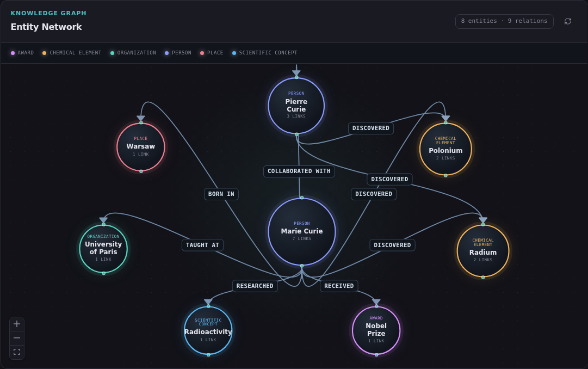

# OpenGraphMemory

OpenGraphMemory is self-hosted GraphRAG platform for document ingestion, vector and graph retrieval, grounded answers with citations, provider plugins, and scoped agent memory.

## Features

### Dataset and document ingestion

- Project-isolated datasets and documents.
- Streaming uploads with size, type, and signature validation.
- Duplicate detection through content hashes.
- Object storage backed document lifecycle.
- Durable Celery ingestion jobs, retries, leases, and transactional outboxes.

### Vector RAG

- Deterministic or provider-backed chunk embeddings.
- Source-aware chunks: PDF pages and CSV logical records never cross chunk boundaries; citations retain page, record, and part location.
- Qdrant vector indexing and retrieval.
- Grounded answers with document citations.
- Evidence validation and unanswerable-query handling.

### Knowledge graph

- Entity, relation, and evidence extraction.
- PostgreSQL authoritative graph records.
- Neo4j rebuildable graph projection.
- Bounded graph inspection and relation review APIs.
- Provenance, timestamps, cleanup outbox, retries, and reconciliation.

### Hybrid retrieval

- `vector_only`, `graph_only`/`graph_local`, `graph_global`, and `hybrid` modes.
- Bounded graph traversal with depth 1–2.
- Community report selection with source-chunk-only citations.
- RRF or weighted candidate fusion.
- Timeout fallback when graph projection is unavailable.
- Retrieval traces containing candidates, graph paths, provenance, latency, and fallback state.

### Dashboard and trace explorer

- Dataset and document management.
- Document upload.
- Query playground with retrieval-mode selector.
- Citation and source evidence viewer.
- Graph-path visualization.
- Retrieval trace and latency inspector.
- Responsive web interface.

#### Knowledge graph visualization preview



*Interactive radial entity network rendered by actual web UI using representative biography data. Node size reflects connectivity, color identifies entity type, and directed edges show extracted semantic relations. Runtime graphs come from documents uploaded to each dataset.*

### Plugin contracts and Python SDK

- Contracts for embedding, chat, extraction, parsing, chunking, object storage, vector storage, graph storage, and graph retrieval.
- Deterministic built-in providers for local development and tests.
- OpenAI-compatible provider configuration.
- Provider conformance tests.
- Async Python SDK for projects, datasets, documents, queries, graph APIs, and memory APIs.

### Agent Memory Preview

- Users, agents, sessions, messages, and facts.
- User, agent, and session scopes.
- Fact provenance and temporal validity.
- Conflict resolution and supersession chains.
- Soft deletion and active-fact retrieval.
- Optional memory personalization in query requests.

## Architecture

Authoritative stores:

- **PostgreSQL:** projects, datasets, documents, ingestion state, graph/community records, traces, outboxes, and memory.
- **S3-compatible object storage:** uploaded source documents.

Rebuildable projections:

- **Qdrant:** chunk vectors.
- **Neo4j:** graph projection.

Runtime services:

- **FastAPI:** HTTP API, authentication, retrieval, graph review, and memory endpoints.
- **Celery workers:** ingestion, indexing, graph extraction, projection, cleanup, and retries.
- **Community worker:** durable community-report jobs from PostgreSQL outbox, leases, and retries.
- **Redis:** Celery broker/runtime queue.
- **React/Vite:** dashboard and trace explorer.
- **Caddy:** static web serving and `/api` reverse proxy.

## Requirements

Recommended local setup:

- Docker Engine
- Docker Compose v2
- At least 4 GB free RAM for full local stack

Host development:

- Python 3.12+
- `uv`
- Node.js 22+
- npm

## Quick Start with Docker

1. Clone repository:

```sh
git clone https://github.com/ardiannurcahya/open-graph-memory.git
cd open-graph-memory
```

2. Create environment file:

```sh
cp .env.example .env
```

3. Replace every `change-me` value in `.env`.

4. Validate Compose configuration:

```sh
docker compose -f deployments/docker-compose.yml config --quiet
```

5. Start stack:

```sh
docker compose -f deployments/docker-compose.yml up -d
```

6. Check services:

```sh
curl -fsS http://localhost:3000/api/health
curl -fsS http://localhost:3000/api/ready
```

Open:

- Dashboard: `http://localhost:3000`
- OpenAPI: `http://localhost:3000/api/docs`
- Metrics: `http://localhost:3000/api/metrics`

Stop stack without deleting data:

```sh
docker compose -f deployments/docker-compose.yml down
```

Delete stack and local volumes only when data loss is intended:

```sh
docker compose -f deployments/docker-compose.yml down -v
```

## Environment Configuration

Important variables:

| Variable | Purpose |
|---|---|
| `POSTGRES_PASSWORD` | PostgreSQL password |
| `ADMIN_API_KEY` | Key used to create projects |
| `S3_ENDPOINT_URL` | S3-compatible endpoint |
| `S3_ACCESS_KEY` | Object-storage access key |
| `S3_SECRET_KEY` | Object-storage secret key |
| `EMBEDDING_PROVIDER` | Embedding provider name |
| `CHAT_PROVIDER` | Chat provider name |
| `EMBEDDING_MODEL` | Embedding model identifier |
| `CHAT_MODEL` | Chat model identifier |
| `OPENAI_BASE_URL` | OpenAI-compatible API base URL |
| `OPENAI_API_KEY` | Provider API key |
| `QDRANT_URL` | Qdrant endpoint |
| `NEO4J_URL` | Neo4j HTTP endpoint |
| `NEO4J_AUTH` | Neo4j `username/password` |
| `WORKER_CONCURRENCY` | Ingestion worker concurrency |
| `COMMUNITY_WORKER_CONCURRENCY` | Community report worker concurrency |

Default deterministic providers require no external model credentials and support reproducible local tests.

For complete service inventory, local/cloud replacement matrix, per-service environment
variables, and full-local/hybrid/managed deployment profiles, see
[Service and Provider Configuration](docs/service-configuration.md).

## Community GraphRAG

Dashboard hierarchy uses deterministic Louvain communities over PostgreSQL-authoritative entities and non-rejected relations. Quotient-graph passes build stable parent hierarchy: level `0` detailed, `1` thematic, `2` overview. Neo4j remains rebuildable projection.

```text
POST /v1/datasets/{dataset_id}/analytics/refresh
GET  /v1/datasets/{dataset_id}/graph/explorer
```

Explorer provides bounded nodes, weighted relations, stable community colors, degree/importance metrics, graph density, search/filter controls, force-layout tuning, neighborhood highlighting, and entity details. Current synchronous analytics refresh is limited to 5,000 entities and 20,000 relations per dataset; larger datasets require a later asynchronous analytics worker.

Semantic zoom selects detail, thematic, or overview membership from viewport density. Manual selection locks level until unlocked. Community reports use durable PostgreSQL jobs/outbox/retries and grounded provenance; reports select and hydrate backing chunks, while answers cite chunks only.

Report and explorer API paths, query-mode behavior, report-selection limitation, migrations, limits, and operational checks: [Community GraphRAG](docs/community-graphrag.md).

OpenAI-compatible providers:

```dotenv
EMBEDDING_PROVIDER=openai
CHAT_PROVIDER=openai
OPENAI_BASE_URL=https://api.openai.com/v1
OPENAI_API_KEY=replace-with-provider-key
EMBEDDING_MODEL=replace-with-embedding-model
CHAT_MODEL=replace-with-chat-model
```

Never commit `.env` or provider credentials.

## Basic API Flow

All project resources require:

```text
X-Project-Id: <project-id>
X-Api-Key: <project-api-key>
```

Use OpenAPI at `/api/docs` for complete schemas.

Typical flow:

1. Create project using admin credentials.
2. Create dataset.
3. Upload document.
4. Wait until document reaches indexed/graph-complete state.
5. Query using vector, graph, or hybrid mode.
6. Inspect citations and retrieval trace.

Example query body:

```json
{
  "dataset_id": "<dataset-id>",
  "query": "What does the document say about recovery?",
  "mode": "hybrid",
  "top_k": 8,
  "graph_depth": 2,
  "include_communities": true,
  "community_level": 0
}
```

Memory-personalized query:

```json
{
  "dataset_id": "<dataset-id>",
  "query": "Give recommendations matching my preferences",
  "retrieval_mode": "hybrid",
  "memory_user_id": "<memory-user-id>",
  "memory_agent_id": "<memory-agent-id>",
  "memory_session_id": "<memory-session-id>",
  "memory_top_k": 5
}
```

Memory context personalizes answer generation but is not emitted as document citation evidence.

## Dashboard

After stack starts, open `http://localhost:3000` and enter project ID plus API key.

Dashboard supports:

1. Create/select dataset.
2. Upload document.
3. Monitor document lifecycle.
4. Open Query Playground.
5. Select `vector_only`, `graph_only`, or `hybrid`.
6. Inspect answer, citations, evidence, graph paths, and retrieval latency.

See [Dashboard and Trace Explorer](docs/dashboard.md).

## Python SDK

SDK source lives in `packages/sdk`.

Development installation:

```sh
uv sync --frozen --group dev
```

SDK supports project, dataset, document, query, graph, and memory operations. See [Python SDK](docs/sdk-python.md) for configuration and examples.

## Provider Plugins

Provider contracts live in `packages/contracts`.

Implement required protocol, register provider through application plugin registry, then run conformance tests. Dynamic package entry-point discovery is not enabled.

See:

- [Plugin system](docs/plugin-system.md)
- [Service and provider configuration](docs/service-configuration.md)
- `examples/plugins/deterministic_embedding.py`

## Development

Install Python dependencies:

```sh
uv sync --frozen --group dev
```

Run Python gates:

```sh
uv run ruff check .
uv run mypy
uv run pytest
```

Run web gates:

```sh
cd apps/web
npm ci
npm run lint
npm run typecheck
npm test
npm run build
```

Run memory evaluator:

```sh
uv run python evaluation/memory_evaluator.py
```

Runtime integration gates:

```sh
./scripts/runtime-gate.sh
./scripts/m1-runtime-gate.sh
./scripts/m2-runtime-gate.sh
./scripts/m3-runtime-gate.sh
./scripts/m4-runtime-gate.sh
```

Runtime gates create and destroy their own test resources. Run them on CI or machine with enough RAM.

## Production Deployment

Validate production configuration:

```sh
GHCR_NAMESPACE=<namespace> IMAGE_TAG=<immutable-tag> \
  docker compose \
  -f deployments/docker-compose.yml \
  -f deployments/docker-compose.prod.yml \
  config --quiet
```

Production deployment should:

- use published immutable image references;
- run migration as explicit release step;
- create verified backup before migration;
- avoid building images on production host;
- restrict databases and `/api/metrics` from public access;
- terminate TLS through Caddy or trusted ingress;
- monitor readiness, errors, latency, queues, memory, swap, disk, and restarts.

Full procedure: [Production deployment](docs/deployment.md).

## Backup and Restore

Create local authoritative-store backup:

```sh
scripts/backup.sh
```

Restore is destructive. Read runbook first, then run:

```sh
RESTORE_CONFIRM=RESTORE scripts/restore.sh backups/<timestamp>
```

Encrypt backups and copy them off-host. For external S3, use provider-native versioning/export.

See [Backup and restore runbook](docs/runbooks/backup-restore.md).

## Health and Metrics

- `GET /api/health`: API process liveness.
- `GET /api/ready`: PostgreSQL, Redis, Qdrant, Neo4j, and object-storage readiness.
- `GET /api/metrics`: Prometheus text metrics.

Restrict metrics endpoint at network or reverse-proxy layer in public deployments.

## Troubleshooting

### API is healthy but not ready

```sh
curl -s http://localhost:3000/api/ready
```

Inspect failed dependency, then check:

```sh
docker compose -f deployments/docker-compose.yml ps
docker compose -f deployments/docker-compose.yml logs api postgres redis qdrant neo4j rustfs
```

### Document remains queued

Check workers and dispatcher:

```sh
docker compose -f deployments/docker-compose.yml logs worker graph-worker dispatcher
```

Confirm Redis/PostgreSQL readiness and inspect durable job/outbox state before retrying.

### Graph retrieval unavailable

Check Neo4j and graph worker. Hybrid mode can fall back, but graph projection must be reconciled after recovery.

### Vector retrieval unavailable

Check Qdrant and indexing state. PostgreSQL and object storage remain authoritative; rebuild projection after recovery.

### Web build fails during `npm ci`

Retry after cleaning npm cache only when lockfile remains unchanged:

```sh
npm cache verify
npm ci
```

Do not replace `npm ci` with an unlocked production install.

## Documentation

- [Local quickstart](docs/quickstart.md)
- [Dataset upload](docs/dataset-upload.md)
- [Vector RAG](docs/vector-rag.md)
- [Graph extraction](docs/graph-extraction.md)
- [Hybrid retrieval](docs/hybrid-retrieval.md)
- [Dashboard](docs/dashboard.md)
- [Plugin system](docs/plugin-system.md)
- [Python SDK](docs/sdk-python.md)
- [Agent Memory Preview](docs/agent-memory-preview.md)
- [Deployment](docs/deployment.md)
- [Operations runbook](docs/runbooks/operations.md)
- [Backup/restore runbook](docs/runbooks/backup-restore.md)
- [Security audit](docs/security-final-audit.md)
- [Evaluation](evaluation/README.md)

## Current Limitations

- Agent memory uses bounded lexical retrieval, not semantic vector memory retrieval.
- Dynamic plugin entry-point discovery is not enabled.
- JavaScript/TypeScript SDK is not provided.
- Small-VPS limits are configuration targets, not measured capacity guarantees.
- Production use still requires load testing, restore drills, external monitoring, secret management, and environment-specific security review.

## License

See repository license file if present.
