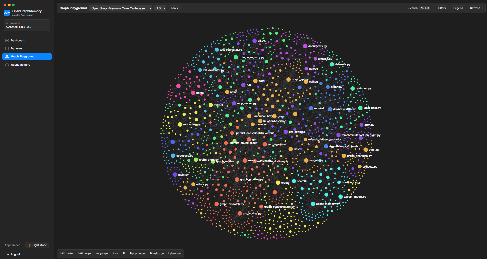

# OpenGraphMemory

<p align="center">
  
</p>

<p align="center">
  <strong>Self-hosted platform for knowledge graph extraction, exploration, and AI agent memory</strong>
</p>

<p align="center">
  <a href="#quickstart">Quickstart</a> •
  <a href="#features">Features</a> •
  <a href="#architecture">Architecture</a> •
  <a href="#api">API</a> •
  <a href="#documentation">Documentation</a> •
  <a href="#contributing">Contributing</a>
</p>

<p align="center">
  
  
  
  
  
</p>

---

## Why OpenGraphMemory?

**OpenGraphMemory** transforms unstructured documents into queryable knowledge graphs and provides persistent memory for AI agents. It's designed for teams who need:

- **Document Intelligence** — Extract entities, relations, and evidence from PDFs, Markdown, and HTML
- **Knowledge Graphs** — Temporal graph storage with traversal, search, and community analytics
- **AI Agent Memory** — Persistent operational memory across coding sessions with confidence scoring
- **Self-hosted Control** — Full ownership of your data with no external dependencies

### Use Cases

| Use Case | Description |
|----------|-------------|
| **Codebase Intelligence** | Extract architecture knowledge from repos, docs, and ADRs |
| **Research Knowledge Base** | Build explorable graphs from papers, specs, and documentation |
| **AI Agent Memory** | Give Claude Code, Cursor, or custom agents persistent memory |
| **Compliance & Audit** | Track decision provenance and evidence chains |

---

## Features

### Knowledge Graph Platform

- **Document Ingestion** — Streaming uploads with validation, deduplication, and multi-format parsing
- **Graph Extraction** — Deterministic, NLP, and LLM-powered entity/relation extraction
- **Temporal Storage** — PostgreSQL-authoritative graph with historical fact queries
- **Graph Traversal** — Search, neighbors, paths, subgraphs, and evidence inspection
- **Community Analytics** — Hierarchical community detection with density and importance metrics
- **Interactive Playground** — React/Vite UI with force-directed visualization

### AI Agent Memory

- **Episode Tracking** — Record problem-solving sessions with domain, goals, and signatures
- **Attempt Logging** — Hypothesis-driven actions with success/failed/partial outcomes
- **Verified Outcomes** — CI, runtime, test, and build verifiers with confidence scoring
- **Pattern Learning** — Aggregated experience keys with Bayesian confidence and promotion
- **Temporal Supersession** — Version history with automatic lineage tracking
- **9 Memory Types** — bugfix, decision, preference, procedure, research, trading, learning, fact, custom

### Data Governance

- **Legal Hold** — Compliance controls to prevent deletion of specific resources
- **Retention Policy** — Automated data lifecycle with archive/delete actions
- **Export/Import** — Full project data portability with credential sanitization
- **Audit Trail** — Complete mutation logging for all operations
- **Secret Redaction** — Automatic detection and redaction of API keys, tokens, passwords

### Operational Tools

- **CLI Commands** — backup, restore, integrity, vacuum, fts-rebuild, checkpoint
- **Health Monitoring** — Liveness, readiness, and Prometheus metrics endpoints
- **Graceful Shutdown** — Clean process termination with connection draining

### MCP Integration

- **Streamable HTTP** — Native MCP endpoint at `/mcp` with session management
- **stdio Server** — Direct agent integration without network overhead
- **6 MCP Tools** — memory_observe, memory_commit, memory_recall, memory_feedback, memory_forget, memory_inspect

---

## Architecture

```
┌─────────────────────────────────────────────────────────────┐
│                    OpenGraphMemory Stack                     │
├─────────────────────────────────────────────────────────────┤
│                                                             │
│   Browser ──► Caddy ──► FastAPI ──► PostgreSQL              │
│                                  ├──► S3 Object Storage     │
│                                  └──► Redis ──► ARQ Worker  │
│                                                             │
│   Upload ──► Parse ──► Chunk ──► Extract                    │
│          ──► Persist Temporal Graph                         │
│          ──► Refresh Community Analytics                    │
│                                                             │
│   Agent Memory ──► Episodes, Attempts, Outcomes, Patterns   │
│                ──► Temporal Supersession                    │
│                ──► Verified Experience Retrieval            │
│                                                             │
└─────────────────────────────────────────────────────────────┘
```

| Component | Purpose |
|-----------|---------|
| **PostgreSQL** | Authoritative storage for projects, datasets, documents, graph records, evidence, analytics, and agent memory |
| **S3-compatible** | Object storage for uploaded source documents |
| **Redis** | Transient queue for ARQ background workers |
| **FastAPI** | Authenticated REST API with OpenAPI documentation |
| **React/Vite** | Dashboard and Graph Playground UI |

---

## Quickstart

### Prerequisites

- Docker Engine and Docker Compose v2
- At least 4 GB free RAM

### Installation

```sh
# Clone repository
git clone https://github.com/ardiannurcahya/open-graph-memory.git
cd open-graph-memory

# Configure environment
cp .env.example .env
# Edit .env and replace all 'change-me' values

# Start stack
docker compose -f deployments/docker-compose.yml config --quiet
docker compose -f deployments/docker-compose.yml up -d

# Verify health
curl -fsS http://localhost:3000/api/health
curl -fsS http://localhost:3000/api/ready
```

### Access Points

| Service | URL |
|---------|-----|
| Dashboard & Graph Playground | http://localhost:3000 |
| API Documentation (OpenAPI) | http://localhost:3000/api/docs |
| Prometheus Metrics | http://localhost:3000/api/metrics |

### Stop & Cleanup

```sh
# Stop without deleting data
docker compose -f deployments/docker-compose.yml down

# Delete volumes (data loss intended)
docker compose -f deployments/docker-compose.yml down -v
```

---

## API

### Authentication

Project resources require authentication headers:

```text
X-Project-Id: <project-id>
X-Api-Key: <project-api-key>
```

### Core Endpoints

#### Knowledge Graph

```http
GET  /v1/datasets/{dataset_id}/graph          # Get dataset graph
GET  /v1/datasets/{dataset_id}/entities/search # Search entities
GET  /v1/entities/{entity_id}                  # Get entity details
GET  /v1/entities/{entity_id}/neighbors        # Get entity neighbors
GET  /v1/datasets/{dataset_id}/graph/path      # Find path between entities
GET  /v1/datasets/{dataset_id}/graph/subgraph  # Get bounded subgraph
GET  /v1/evidence/{evidence_id}                # Get evidence details
```

#### Agent Memory

```http
POST /v1/agent-memory/episodes                 # Create episode
GET  /v1/agent-memory/episodes                 # List episodes
GET  /v1/agent-memory/episodes/{id}            # Get episode details
POST /v1/agent-memory/episodes/{id}/attempts   # Append attempt
POST /v1/agent-memory/episodes/{id}/outcomes   # Record outcome
POST /v1/agent-memory/episodes/{id}/confidence # Apply confidence feedback
GET  /v1/agent-memory/episodes/{id}/versions   # Get version history
GET  /v1/agent-memory/search                   # Search episodes
GET  /v1/agent-memory/types                    # List memory types
```

#### Data Governance

```http
POST /v1/legal-holds                           # Create legal hold
GET  /v1/legal-holds                           # List legal holds
POST /v1/retention/preview                     # Preview retention
POST /v1/retention/apply                       # Apply retention policy
GET  /v1/audit-logs                            # Query audit logs
GET  /v1/projects/{id}/export                  # Export project data
POST /v1/projects/{id}/import                  # Import project data
```

#### MCP (Model Context Protocol)

```http
POST /mcp                                      # MCP Streamable HTTP endpoint
```

### Example: Record AI Agent Experience

```bash
# Create episode
curl -X POST http://localhost:3000/v1/agent-memory/episodes \
  -H "X-Project-Id: <project-id>" \
  -H "X-Api-Key: <api-key>" \
  -H "Content-Type: application/json" \
  -d '{
    "domain": "engineering",
    "type": "bugfix",
    "title": "Fix deployment failure",
    "goal": "Resolve API startup crash",
    "problem_signature": "api-deploy-failure",
    "content": {
      "summary": "Missing S3 credentials caused startup crash",
      "root_cause": "S3_ENDPOINT_URL not set in environment",
      "fix": "Added S3_ENDPOINT_URL to .env file",
      "verified": true
    },
    "confidence": 0.9
  }'

# Search experience
curl "http://localhost:3000/v1/agent-memory/search?q=deployment+S3" \
  -H "X-Project-Id: <project-id>" \
  -H "X-Api-Key: <api-key>"
```

---

## MCP Integration

Connect AI agents directly to OpenGraphMemory using the MCP protocol:

### Claude Code / Cursor / OpenCode

```json
{
  "mcpServers": {
    "ogm": {
      "command": "uvx",
      "args": ["ogm-agent-bridge==0.1.7"],
      "env": {
        "OGM_BASE_URL": "http://localhost:3000",
        "OGM_API_KEY": "<project-api-key>",
        "OGM_PROJECT_ID": "<project-uuid>",
        "OGM_PERMISSION_PROFILE": "personal-safe"
      }
    }
  }
}
```

### Permission Profiles

| Profile | Capabilities |
|---------|--------------|
| `read-only` | Graph and agent memory retrieval only |
| `personal-safe` | Document uploads and additive memory records |
| `memory-curator` | Memory feedback and supersession governance |

---

## Configuration

### Environment Variables

| Variable | Purpose | Default |
|----------|---------|---------|
| `DATABASE_URL` | PostgreSQL connection string | Required |
| `REDIS_URL` | Redis connection string | Required |
| `ADMIN_API_KEY` | Admin credential for project creation | Required |
| `S3_ENDPOINT_URL` | S3-compatible endpoint | Required |
| `S3_ACCESS_KEY` | Object storage access key | Required |
| `S3_SECRET_KEY` | Object storage secret key | Required |
| `GRAPH_EXTRACTOR_PROVIDER` | `deterministic`, `nlp`, or `openai` | `deterministic` |
| `GRAPH_EXTRACTOR_MODEL` | Extraction model identifier | — |
| `OPENAI_API_KEY` | OpenAI API key for extraction | — |

See [Service Configuration](docs/service-configuration.md) for complete reference.

---

## Development

### Backend (Python)

```sh
# Install dependencies
uv sync --frozen --group dev

# Run checks
uv run ruff check .          # Lint
uv run mypy                  # Type check
uv run pytest                # Tests

# Full gate
scripts/check.sh
```

### Frontend (React/TypeScript)

```sh
cd apps/web

# Install dependencies
npm ci

# Run checks
npm run lint
npm run typecheck
npm test
npm run build
```

### Database Migrations

```sh
# Create migration
uv run alembic revision --autogenerate -m "description"

# Apply migrations
scripts/migrate.sh
```

---

## Documentation

| Document | Description |
|----------|-------------|
| [Quickstart](docs/quickstart.md) | Local development setup |
| [Architecture](docs/architecture.md) | System design and components |
| [Dataset Upload](docs/dataset-upload.md) | Document ingestion guide |
| [Graph Extraction](docs/graph-extraction.md) | Entity/relation extraction |
| [Community Analytics](docs/community-graphrag.md) | Hierarchical community detection |
| [Agent Memory](#agent-memory-api) | AI agent memory API |
| [Dashboard](docs/dashboard.md) | Graph Playground UI |
| [Python SDK](docs/sdk-python.md) | SDK reference |
| [Plugin System](docs/plugin-system.md) | Provider plugins |
| [Service Configuration](docs/service-configuration.md) | Environment variables |
| [Deployment](docs/deployment.md) | Production deployment |
| [Operations Runbook](docs/runbooks/operations.md) | Operational procedures |
| [Backup/Restore](docs/runbooks/backup-restore.md) | Data backup guide |
| [Security Audit](docs/security-final-audit.md) | Security review |

---

## Contributing

We welcome contributions! Please see [CONTRIBUTING.md](CONTRIBUTING.md) for guidelines.

### Quick Contribution Guide

1. Fork the repository
2. Create a feature branch (`git checkout -b feature/amazing-feature`)
3. Commit your changes (`git commit -m 'feat: add amazing feature'`)
4. Push to the branch (`git push origin feature/amazing-feature`)
5. Open a Pull Request

### Development Setup

```sh
# Clone your fork
git clone https://github.com/YOUR_USERNAME/open-graph-memory.git
cd open-graph-memory

# Install dependencies
uv sync --frozen --group dev
cd apps/web && npm ci && cd ../..

# Run tests
uv run pytest
cd apps/web && npm test && cd ../..
```

---

## Current Limitations

- Analytics refresh is synchronous and bounded to 5,000 entities and 20,000 relations per dataset
- Dynamic plugin entry-point discovery is not enabled
- JavaScript/TypeScript SDK is not provided
- Small-VPS limits are targets, not measured capacity guarantees
- Production use requires load tests, restore drills, external monitoring, secret management, and environment-specific security review

---

## License

This project is licensed under the MIT License - see the [LICENSE](LICENSE) file for details.

---

## Acknowledgments

- [FastAPI](https://fastapi.tiangolo.com/) — Web framework
- [SQLAlchemy](https://www.sqlalchemy.org/) — ORM
- [React](https://react.dev/) — Frontend UI
- [Vite](https://vitejs.dev/) — Build tool
- [PostgreSQL](https://www.postgresql.org/) — Database

---

<p align="center">
  Made with ❤️ by <a href="https://github.com/ardiannurcahya">Ardian Nurcahya</a>
</p>
